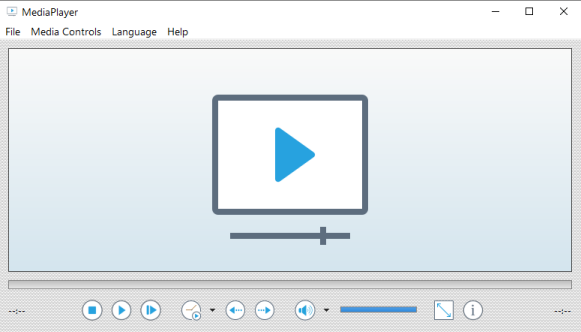

#  MediaPlayer

A basic media player application written in x86 and x64 assembler that utilizes the [MFPlayer-Library](https://github.com/mrfearless/MFPlayer-Library) - which consists of functions that wrap the [MFPlay](https://learn.microsoft.com/en-us/previous-versions/windows/desktop/api/mfplay/) COM implementation of the [IMFPMediaPlayer](https://learn.microsoft.com/en-us/previous-versions/windows/desktop/api/mfplay/nn-mfplay-imfpmediaplayer) and [IMFPMediaItem](https://learn.microsoft.com/en-us/previous-versions/windows/desktop/api/mfplay/nn-mfplay-imfpmediaitem) objects.

# Features

- Supports audio and video media that is natively supported by the [Microsoft Media Foundation API](https://learn.microsoft.com/en-us/windows/win32/medfound/supported-media-formats-in-media-foundation)
- Player controls via toolbar buttons, menu or context menu: Play/Pause Toggle, Stop, Frame Step, Playback Speed, Volume Mute/Unmute, Fullscreen toggle, About.
- Custom control for Volume slider.
- Custom control for Seekbar slider.
- Custom controls for Labels (for duration of media and current position).
- Fullscreen enter via toolbar button, menu, context menu or F11.
- Fullscreen exit via toolbar button, menu, context menu, F11 or Escape.
- Spacebar toggles play/pause and clicking on media item toggles play/pause.
- Step forward or backward 10 seconds.
- Open media file via File menu, context menu, clicking screen logo, or clicking play button.
- Open media file via command line or drag and drop.
- Command line supports: 
  - `/close` - close MediaPlayer after media item finishes playing.
  - `/minimized` - start MediaPlayer minimized.
  - `/fullscreen` - switch MediaPlayer to fullscreen mode. 
  - `/volume:x` - set initial volume, where `x` is the volume level to set (0-100).
- Playback speed menu available in menus and as a dropdown from the playback speed button.
- Audio stream menu available in menus and as a dropdown from the volume mute toggle button.
- 'i' button shows a tooltip with information about the current media item: audio and video codec, bitrate, etc.
- Compiled for Unicode support.
- Language menu shows supported languages that can be selected.
- Uses the [MFPlayer-Library](https://github.com/mrfearless/MFPlayer-Library)
- Uses the [FileDialog-Library](https://github.com/mrfearless/FileDialog-Library)

# Download

The latest releases can be downloaded [here](https://github.com/mrfearless/mediaplayer/releases).